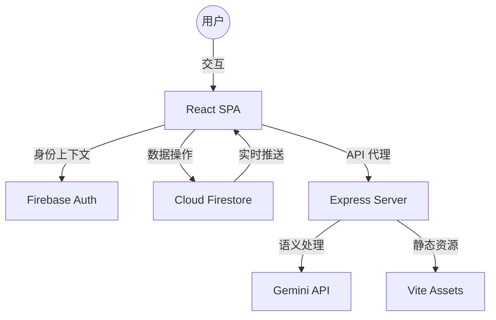

# JCargo CMS - 技术规格与架构文档

## 1. 项目概述 (Project Overview)
### 核心目的
**JCargo CMS** (货运管理系统) 是一款专为航空货运代理和物流服务商打造的生产级物流应用。它涵盖了航空货运从初始报价、订舱、核心操作到财务结算的完整生命周期管理。

### 目标用户
- **系统管理员 (Admin)**：负责系统初始化、用户角色权限分配（RBAC）以及主运价模版管理。
- **销售/商务 (BD)**：管理客户关系（CRM）、生成智能报价单并启动订舱流程。
- **操作员 (Operation)**：实时更新主单（MAWB）状态、处理入库体积及重量确认、报关协调及文件（舱单、草单）上传。
- **财务员 (Finance)**：管理应收账款（AR）、应付账款（AP）、开具发票以及追踪历史结算记录。

### 核心价值主张
- **一体化工作流 (Integrated Workflow)**：从定价到订舱，再到操作与财务，实现无缝衔接。
- **动态定价引擎 (Dynamic Pricing Engine)**：自动计算空运成本，包括等级价调整、各项杂费（燃油、地面处理、安检）及根据报关方式自动计算的报关费。
- **实时同步 (Real-time Synchronization)**：货物生命周期状态全节点追踪。
- **可审计性 (Auditability)**：记录每一份主单的操作日志，确保业务透明。

---

## 2. 技术栈 (Tech Stack)

### 前端 (Frontend)
- **框架**：React 19 (函数式组件, Hooks)。
- **构建工具**：Vite 6。
- **UI 组件库**：Ant Design 5 (应用了现代感/技术感定制主题)。
- **样式方案**：Tailwind CSS 4 (原子化 CSS，用于精准布局和视觉微调)。
- **图标库**：Lucide React。
- **动画库**：Motion (用于路由切换及布局变化的平滑过渡)。
- **状态管理**：React Hooks (useState/useEffect) + Context API (用于 Auth 验证)。
- **国际化**：i18next / react-i18next (支持中英双语)。

### 后端与云基础设施 (Backend & Infrastructure)
- **运行环境**：Node.js (基于 Vite/Express 中间件的全栈环境)。
- **数据库**：Firebase Cloud Firestore (文档型 NoSQL，支持实时同步)。
- **身份认证**：Firebase Authentication (支持 Google 登录及基于角色的邮件登录)。
- **文件存储**：Firebase Storage (用于存储舱单 Manifest、主单草单及发票 PDF)。
- **部署**：Google Cloud Run (容器化部署)。

### 人工智能 (AI Integration)
- **平台**：Google AI Studio。
- **模型**：Gemini (Flash/Pro) 用于智能辅助、数据提取及业务逻辑自动纠错。

### 核心依赖库
- **PDF 生成**：jsPDF + autoTable (用于生成正式报价单、对账单和发票)。
- **Excel 处理**：XLSX (用于舱单数据导出及批量数据处理)。
- **日期处理**：Day.js (轻量化日期格式化方案)。
- **中文搜索**：Pinyin-pro (用于优化的中文/拼音联想搜索)。

---

## 3. 项目目录结构 (Project Directory Structure)

```text
/
├── .env.example              # 环境变量模版
├── firebase-blueprint.json    # 数据模型中间表示 (IR)
├── firestore.rules           # 硬化后的 ABAC 安全规则
├── metadata.json             # 应用元数据 (名称、描述、权限)
├── package.json              # 依赖管理与构建脚本
├── server.ts                 # Express/Vite 全栈入口
├── src/
│   ├── App.tsx               # 路由分发与全局主题配置
│   ├── main.tsx              # 应用入口
│   ├── i18n.ts               # 多语言配置
│   ├── types.ts              # 全局通用类型定义
│   ├── components/           # 通用组件 (Navbar, Header 等)
│   ├── hooks/                # 自定义 Hooks
│   ├── layouts/              # 响应式布局组件
│   ├── lib/                  # 库初始化 (Firebase, AI SDK)
│   ├── services/             # 纯业务逻辑层 (信用评价、PDF 生成)
│   └── modules/              # 业务功能模块
│       ├── Admin/            # 用户管理、系统设置
│       ├── Auth/             # 登录、个人中心、角色配置
│       ├── Business/         # 运价管理、报价系统、客户、订舱
│       ├── Dashboard/        # 数据看板、预警统计
│       ├── Finance/          # 应收/应付管理、开票、结算日志
│       └── Operation/        # 主单追踪、仓库操作、分单/舱单管理
```

---

## 4. 系统架构与数据流 (Architecture & Data Flow)

### 架构示意图 (Mermaid)


### 业务数据流示例 (从订舱到结算)
1. **生成报价 (Quotation)**：销售选择基础运价 `FlightRate`，根据客户等级应用调整，生成 `Quotation`。
2. **确认订舱 (Booking)**：报价单被接受后转为 `Booking`，继承各项附加费（燃油、安检、地面处理）及单价。
3. **主单操作 (MAWB)**：操作员确认机位并填入航空主单号。
4. **财务录入 (Finance)**：当货物状态更新为“已入库”或“已起飞”时，系统自动生成 `AccountsReceivable` (应收) 和 `AccountsPayable` (应付)，并自动拆分费用项。

---

## 5. 核心业务逻辑 (Business Logic)

### 运价与报价引擎
- **等级价调整 (Tiered Adjustments)**：系统为用户分配 0-10 级的等级。报价时应用公式：`最终价 = 基础价 + (等级 * 调整因子)`。
- **附加费管理**：运价模型强制拆分燃油附加费、安检费、地面处理费，确认为“全包价”中的组成部分。
- **计费重量逻辑**：
  - `计费重量 (Chargeable Weight) = Math.max(实际重量, 体积 / 6000)`。
  - `总运费 = 计费重量 * (基础单价 + 各项附加费单价)`。

### 货态工作流 (MAWB Workflow)
主单状态机遵循以下标准路径：
1. `Pending` -> `Booked` (需录入航空公司主单号)
2. `Confirmed` (机位确认)
3. `Warehouse In` (入库：确认毛重、体积、件数)
4. `Customs` (报关：选择报关方式，如 9610、正式报关等)
5. `Departed` -> `Arrived` -> `Closed` (闭环)

### 财务结算拆分
财务模块界面 (`InvoiceList.tsx`) 拒绝使用“单一总金额”修改模式，而是通过读取关联的 `Booking` 数据动态拆分为：
- **空运费 (Air Freight)**：作为核心运价项。
- **附加费**：燃油、安检、地面处理等。
- **报关费**：根据订舱时选择的模式（按票或按公斤）自动计算初始值。
- **杂费 (Misc Fees)**：允许手动添加额外费用项。

---

## 6. 核心算法 (Algorithms)

### 重量计算算法
```typescript
function getChargeableWeight(weight: number, volume: number): number {
  const volWeight = volume / 6000; // 行业标准体积比
  return Math.ceil(Math.max(weight, volWeight));
}
```

### 信用监控逻辑
`CreditService` 会实时计算该客户下所有状态为“待支付”的应收账款总和，并与客户档案中的 `creditLimit` (信用额度) 进行对比，触发风险预警。

---

## 7. 数据模型 (Data Schemas)

### 应付账款 (AccountsPayable)
```typescript
interface AccountsPayable {
  mawbNo: string;        // 关联主单号
  totalAmount: number;   // 总额
  currency: string;      // 币种
  lineItems: {           // 费用明细（必须包含）
    name: string;        // 费用项名称
    quantity: number;    // 数量
    unitPrice: number;   // 单价
    amount: number;      // 合计
  }[];
}
```

---

## 8. 提示词工程 (Prompt Engineering)
AI 系统利用 Gemini 实现以下功能：
- **智能舱单解析**：将非结构化文本或表格图片转化为结构化的 MAWB 录入项。
- **运价趋势建议**：分析历史航线运价，为销售提供最优等级价调整建议。
- **异常原因提取**：根据操作日志自动生成通俗易懂的异常说明。

---

## 9. 安全与错误处理 (Security & Error Handling)

### 安全规范
- **默认拒绝 (Default Deny)**：Firestore 规则默认拒绝所有读写。
- **身份强一致性**：所有写操作强制检查 `request.auth.uid`。
- **PII 保护**：敏感财务数据仅限财务和管理员角色访问。

### 错误处理
项目使用封装的 `handleFirestoreError` 工具，在权限不足或配额超出时返回详细的 JSON 诊断信息 (`FirestoreErrorInfo`)，帮助前端展示具体的错误上下文。

---

## 10. 开发与部署指南 (Deployment Guide)

### 重建步骤
1. 初始化项目环境 (Vite + React + AntD)。
2. 配置 Firebase 项目及 Google 登录权限。
3. 按照 `firebase-blueprint.json` 初始化 Firestore 集合。
4. 部署 `firestore.rules` 规则。
5. 配置 `VITE_FIREBASE_*` 环境变量。

### 开发说明
- **端口**：必须运行在 **3000** 端口。
- **构建环境**：`NODE_ENV=production` 用于执行最终代码混淆与打包。

---

## 11. 附录：近期重点修订记录
- **财务明细化改革**：应付账款 (AP) 操作界面从“手动输入总价”演进为“结构化明细编辑”，旨在通过费用项追溯提升财务数据准确性。
- **模拟客户功能**：为管理员添加了 `Simulation Mode`，允许管理员以任意代理身份预览报价，确保运价配置无误。
