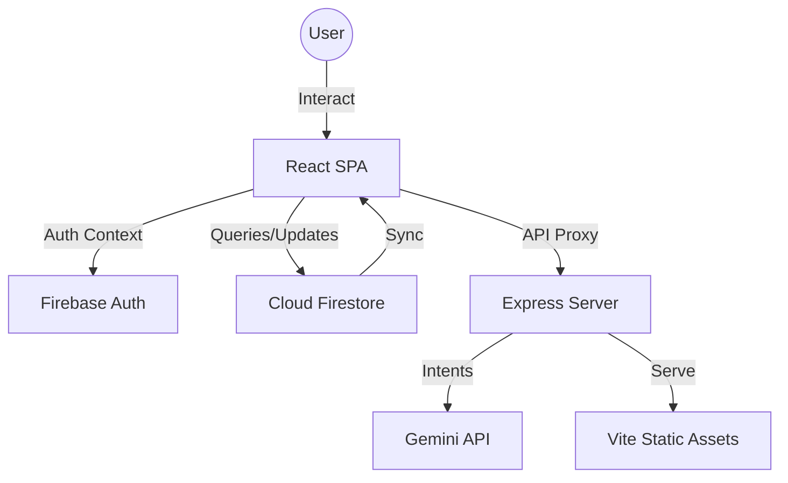

# JCargo CMS - Technical Specification & Architecture Document

## 1. Project Overview
### Core Purpose
**JCargo CMS** (Cargo Management System) is a comprehensive, production-grade logistics application designed specifically for air freight forwarders and logistics service providers to manage the entire lifecycle of air shipments—from initial quotation to financial settlement.

### Target Users
- **Administrators**: System setup, user permissions, and master rate management.
- **Sales/Business (BD)**: Customer relationship management, quotation generation, and booking initiation.
- **Operators**: MAWB (Master Air Waybill) status updates, warehouse processing, customs coordination, and document uploads.
- **Finance**: Management of Accounts Receivable (AR), Accounts Payable (AP), and historical billing logs.

### Key Value Propositions
- **Integrated Workflow**: Seamless transition from pricing to booking to operations.
- **Dynamic Pricing Engine**: Automated calculation of air freight costs including tiers, surcharges (Fuel, Security, Terminal), and customs fees.
- **Real-time Synchronization**: Synchronized status tracking across the shipment lifecycle.
- **Auditability**: Complete operation logs for every MAWB.

---

## 2. Tech Stack

### Frontend
- **Framework**: React 19 (Functional components, Hooks).
- **Build Tool**: Vite 6.
- **UI Component Library**: Ant Design 5 (Theme customized for a technical/modern feel).
- **Styling**: Tailwind CSS 4 (Utility-first styling for layout and custom spacing).
- **Icons**: Lucide React.
- **Animation**: Motion (for smooth layouts and transitions).
- **State Management**: React Hooks (useState/useEffect) + Context API for Auth.
- **Internationalization**: i18next / react-i18next (English & Simplified Chinese).

### Backend & Cloud Infrastructure
- **Runtime**: Node.js (Full-stack environment via Vite/Express middleware).
- **Database**: Firebase Cloud Firestore (NoSQL, real-time).
- **Authentication**: Firebase Authentication (Google Login / Email-Role based).
- **Storage**: Firebase Storage (used for document persistence like Manifests and Draft MAWBs).
- **Deployment**: Google Cloud Run (Containerized runtime).

### AI & Intelligence
- **Platform**: Google AI Studio.
- **Model**: Gemini (Flash/Pro) for intelligent assistance and future data extraction capabilities.

### Utilities
- **PDF Generation**: jsPDF + autoTable (for Official Quotations and Invoices).
- **Excel/Data**: XLSX library (for Manifest exports and data imports).
- **Time/Date**: Day.js (comprehensive date formatting).
- **Search**: Pinyin-pro (for localized Chinese search optimization).

---

## 3. Project Directory Structure

```text
/
├── .env.example              # Environment variable templates
├── firebase-blueprint.json    # Intermediate Representation (IR) of Data Schema
├── firestore.rules           # Security rules (Hardened ABAC)
├── metadata.json             # App metadata (Name, Description)
├── package.json              # Dependency and script management
├── server.ts                 # Express/Vite full-stack entry point
├── src/
│   ├── App.tsx               # Main routing and theme configuration
│   ├── main.tsx              # Application entry point
│   ├── i18n.ts               # Translation configuration
│   ├── types/                # Detailed TypeScript interface definitions
│   ├── components/           # Common UI components (Navbar, Header, etc.)
│   ├── hooks/                # Custom hooks (useAuth, useLocalStorage)
│   ├── layouts/              # Recursive layouts (MainLayout with Sider)
│   ├── lib/                  # Library initializations (Firebase, AI)
│   ├── services/             # Pure business logic (Credit, PDF services)
│   └── modules/              # Feature modules grouped by business function
│       ├── Admin/            # User Management, System Config
│       ├── Auth/             # Login, Personal Center, Profile
│       ├── Business/         # Pricing, Quotation, Customer, Booking
│       ├── Dashboard/        # Analytics, Statistics, Alerts
│       ├── Finance/          # AR/AP, Invoicing, Billing logs
│       └── Operation/        # MAWB tracking, Warehouse, Manifests
```

---

## 4. System Architecture & Data Flow

### Architecture Diagram (Mermaid)


### Data Flow Example (Booking to Finance)
1. **Quotation**: Sales selects a base rate `FlightRate`, applies an adjustment, and creates a `Quotation`.
2. **Booking**: When a quote is accepted, a `Booking` is created, inheriting surcharges (Fuel, Security, Terminal) and unit prices.
3. **MAWB**: Operation confirms space, generating an internal `MAWB` number.
4. **Finance**: Upon "Warehouse In" or "Departed", the system automatically flags the shipment for settlements, pre-populating `AccountsReceivable` and `AccountsPayable` with price breakdowns.

---

## 5. Business Logic

### Pricing & Quotation Engine
- **Tiered Adjustments**: Customers/Sales are assigned a "Tier" (0-10). Base rates are adjusted dynamically: `Final = Base + (Base * Adjustment%)`.
- **Surcharge Management**: Rates include separate fields for Fuel, Security, and Terminal Handling. 
- **Calculated Totals**: 
  - `ChargeableWeight = Math.max(actual_weight, volume / 6000)`.
  - `FreightTotal = ChargeableWeight * (BasePrice + Surcharges)`.

### MAWB Status Workflow
The MAWB transitions through a linear state machine:
1. `Pending` -> `Booked` (Airline MAWB # required)
2. `Confirmed` (Space availability verified)
3. `Warehouse In` (Gross weight and dims confirmed)
4. `Customs` (Declaration method selected: 9610, formal, etc.)
5. `Departed` -> `Arrived` -> `Closed`

### Finance & Invoicing
- **Breakdown logic**: The invoice UI (`InvoiceList.tsx`) doesn't show just a "Total". It fetches the linked `Booking` to split the amount into:
  - Air Freight (calculated as remainder or base).
  - Fuel Surcharge.
  - Terminal Handling Fee.
  - Customs Clearance Fee (based on declaration method amount).
  - Miscellaneous Fees.

---

## 6. Logic & Algorithms

### Weight Calculation
```typescript
function getChargeableWeight(weight: number, volume: number): number {
  const volWeight = volume / 6000; // Standard air freight ratio
  return Math.ceil(Math.max(weight, volWeight));
}
```

### Credit Monitoring
The `CreditService` evaluates real-time balances by summing unpaid `AccountsReceivable` entries of a customer and comparing them against the `creditLimit` defined in the customer profile.

---

## 7. Data Models (Key Schemas)

### FlightRate (Carrier Pricing)
```typescript
interface FlightRate {
  carrier: string;
  origin: string;
  destination: string;
  baseFreight: number;
  fuelSurcharge: number; 
  securityScreening: number;
  terminalHandling: number;
  customsMethods: Record<ExportDeclarationMethod, FeeStructure>;
}
```

### AccountsPayable (Vendor Settlements)
```typescript
interface AccountsPayable {
  mawbNo: string;
  totalAmount: number;
  status: 'pending' | 'paid';
  lineItems: { name: string, quantity: number, unitPrice: number, amount: number }[];
}
```

---

## 8. Prompt Engineering & AI Instructions
The system is designed to leverage Gemini for:
- **Intelligent Manifest Parsing**: Converting erratic Excel/Photo data into structured `MAWB` entries.
- **Price Forecasting**: Analyzing historical routes to suggest optimal BD adjustments.
- **Automated Exception Summaries**: Generating clear explanations for "Exception" status shipments based on logs.

---

## 9. Security & Error Handling

### Security Pillars
- **Default Deny**: Firestore rules block all access unless explicitly allowed.
- **Identity Integrity**: `resource.data.userId == request.auth.uid`.
- **Relational Guards**: Users can only see shipments if their `regions` or `warehouses` allow.

### Error Handling Pattern
The application uses a custom `handleFirestoreError` utility that catches native permission errors and wraps them in a structured JSON object (`FirestoreErrorInfo`) for diagnostic accuracy in production.

---

## 10. Development & Deployment Guide

### Reconstruction Steps
1. Initialize a Vite-React-AntD project.
2. Configure Firebase Auth with Google Provider.
3. Provision Firestore with the collections defined in `firebase-blueprint.json`.
4. Deploy the `firestore.rules` using the Firebase CLI.
5. Set `VITE_FIREBASE_*` environment variables.

### Port Requirements
- Standard runtime: Port **3000** (Proxied via Nginx).

---

## 11. Appendix

### Recent UI Improvements
- **Finance Breakdown**: Switched from total amount edits to a structured "Itemized Breakdown" grid to ensure billing accuracy.
- **Dashboard Alerts**: Added color-coded urgency for "Credit Limit Breaches" and "Delayed Shipments".
